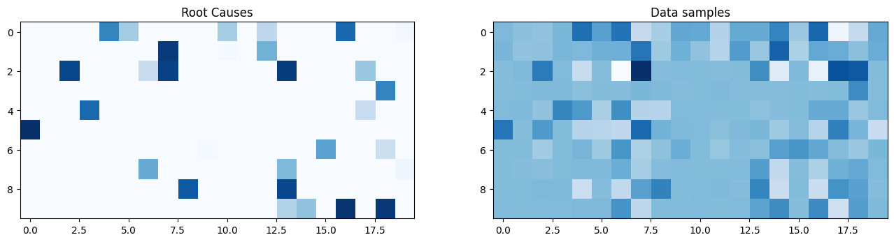
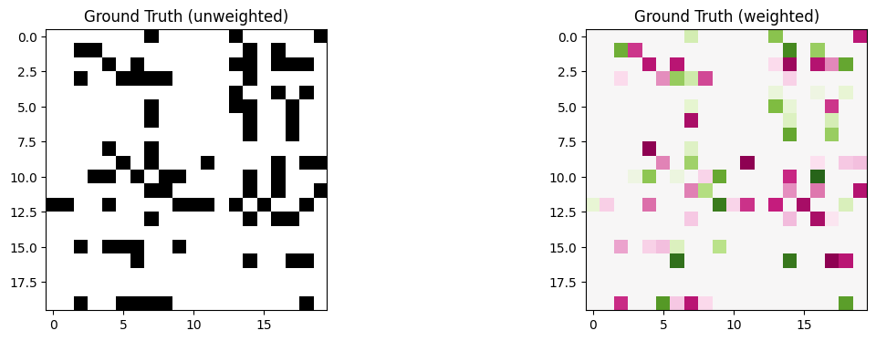
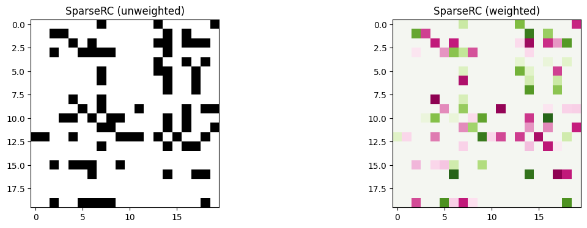

<div align="center">    
 
# Learning DAGs from Data with Few Root Causes

</div>
 
## Description   
This is the implementation of our method and experiments of our paper accepted in NeurIPS 2023. 

If you find this repository useful please cite:

```
@inproceedings{misiakos2023learning,
      title={Learning DAGs from Data with Few Root Causes}, 
      author={Panagiotis Misiakos and Chris Wendler and Markus Püschel},
      booktitle = {Advances in Neural Information Processing Systems},
      year={2023},
}
```

## SparseRC
Our method is called SparseRC (from sparser root causes). To use it you can simply install Python with the required packages in [`sparserc_requirements.txt`](sparserc/sparserc_requirements.txt
)

A demonstration of our DAG learning method is shown in [`SparseRC_demo.ipynb`](SparseRC_demo.ipynb)


### Method description
We consider the formulation of linear SEMs as a linear transformation of the input (defined as root causes) that gives the data as output. 


Motivated by this new formulation we propose the novel DAG learning method that assumes sparsity in the input side - namely few root causes. 




## Full experiment reproducibility 
Current version of the code was run successfully in Windows 11 with python 3.9.7.

### Environment and packages
Setup the python environment:

```bash
# create a new conda environment
conda create -n sparserc python=3.9.7
conda activate sparserc

# install all requirements with pip
pip install -r requirements.txt
```

Special care must be taken for installing the pydot package.
We suggest installation using conda.
```bash
# install pydot with conda
conda install pydot
```

### Other repos

Then manually import the following repositories. 
```bash
# install py-causal repo
pip install git+https://github.com/bd2kccd/py-causal

# clone the following repositories
cd neurips_experiments/methods/
git clone https://github.com/xunzheng/notears
git clone https://github.com/cdt15/lingam
git clone https://github.com/Scriddie/Varsortability
git clone https://github.com/kevinsbello/dagma
git clone https://github.com/ignavierng/golem
git clone https://github.com/fishmoon1234/DAG-NoCurl NoCurl
```

Make sure to have R installed and that the path to the R directory in file **experiment.py** is correct. Also note the required packages on R for the [causal discovery toolbox](https://fentechsolutions.github.io/CausalDiscoveryToolbox/html/index.html).

<!-- ```bash
R version 4.2.1
install.packages("BiocManager")
BiocManager::install(c("graph", "RBGL", "Rgraphviz"))
sudo apt install libgsl-dev libcurl4-openssl-dev libssl-dev libharfbuzz-dev libfribidi-dev
install.packages('pcalg')
install.packages('kpcalg')
install.packages('devtools')
install_github("Diviyan-Kalainathan/RCIT", force=TRUE)
library('pcalg')
library('kpcalg')
library('devtools')
library('RCIT')

install.packages(c('glmnet', 'mboost', 'Matrix', 'parallel', 'mgcv'))
url <- 'https://cran.r-project.org/src/contrib/Archive/CAM/CAM_1.0.tar.gz'
pckg <- 'CAM_1.0.tar.gz'
download.file(url = url, destfile = pckg)
library('CAM')

install.packages(pkgs=pckg, type="source", repos=NULL)
url <- 'https://cran.r-project.org/src/contrib/Archive/SID/SID_1.0.tar.gz'
pckg <- 'SID_1.0.tar.gz'
download.file(url = url, destfile = pckg)
install.packages(pkgs=pckg, type="source", repos=NULL)
library('SID')

q()
``` -->

### Execution   
```bash
# run all experiments
bash run.sh
# plots and tables
bash report.sh
```